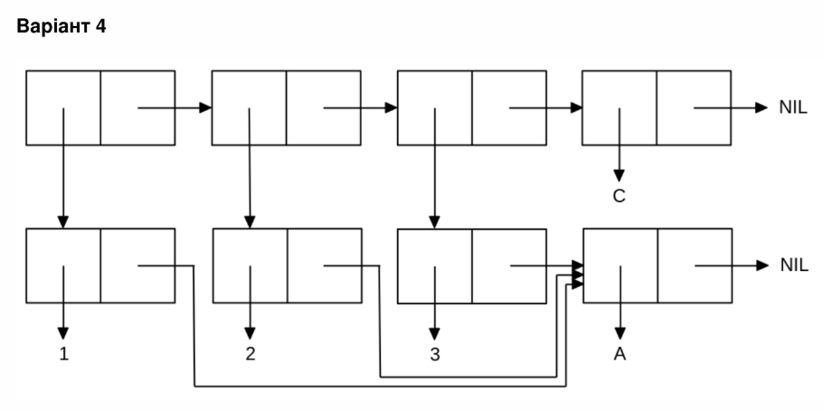

<p align="center"><b>МОНУ НТУУ КПІ ім. Ігоря Сікорського ФПМ СПіСКС</b></p>
<p align="center">
<b>Звіт з лабораторної роботи 1</b><br/>
"Обробка списків з використанням базових функцій"<br/>
дисципліни "Вступ до функціонального програмування"
</p>
<p align="right"><b>Студентка</b>: Буц Аліса Сергіївна КВ-23<p>
<p align="right"><b>Рік</b>: 2025<p>

## Загальне завдання

1. Створіть список з п'яти елементів, використовуючи функції `LIST` і `CONS`.Збережіть створений список у якусь змінну з `SET` або `SETQ`

   ```lisp
   CL-USER> (list 1 2 3 '(v d f p) '())
   (1 2 3 (V D F P) NIL)
   CL-USER> (cons 1 '( 2 3 (v d f p) ()))
   (1 2 3 (V D F P) NIL)
   CL-USER> (set 'list-1 (list 1 2 3 '(v d f p) '()))
   (1 2 3 (V D F P) NIL)

   ```

2. Отримайте голову списку.

   ```lisp
   CL-USER> (car list-1)
   1
   ```

3. Отримайте хвіст списку.

   ```lisp
   CL-USER> (cdr list-1)
   (2 3 (V D F P) NIL)
   ```

4. Отримайте третій елемент списку.

   ```lisp
   CL-USER> (third list-1)
   3
   ```

5. Отримайте останній елемент списку.

   ```lisp
   CL-USER> (last list-1)
   (NIL)
   ```

6. Використайте предикати `ATOM` та `LISTP` на різних елементах списку (по 2-3
   приклади для кожної функції).

   ```lisp
   CL-USER> (atom (first list-1))
   T
   CL-USER> (atom (third list-1))
   T
   CL-USER>  (atom (nth 3  list-1))
   NIL
   CL-USER> (listp (first list-1))
   NIL
   CL-USER> (listp (third list-1))
   NIL
   CL-USER>  (listp (nth 3  list-1))
   T
   ```

7. Використайте на елементах списку 2-3 інших предикати з розглянутих у розділі 4
   навчального посібника.

   ```lisp
   CL-USER> (eq (nth 3  list-1) '(v d f p))
   NIL
   CL-USER> (= (second list-1) 2)
   T
   CL-USER> (butlast list-1)
   (1 2 3 (V D F P))
   ```

8. Об'єднайте створений список з одним із його непустих підсписків. Для цього
   використайте функцію `APPEND`.

   ```lisp
   CL-USER> (append list-1 (nth 3 list-1))
   (1 2 3 (V D F P) NIL V D F P)                            
   ```

## Завдання за варіантом №4

<p align="center">

</p>

```lisp
 (setq list4 '(a)
      pair1 (cons 1 list4)
      pair2 (cons 2 list4)
      pair3 (cons 3 list4)
      list3 (list pair1 pair2 pair3 'c))
list3
((1 A) (2 A) (3 A) C)
```
